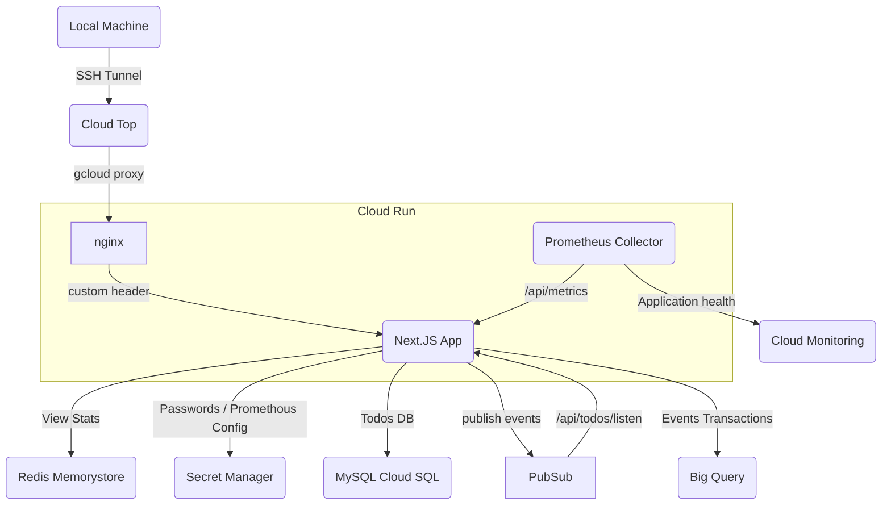

## About




This is an over-architected minimalist to-do list application that uses the following:

- [x] Next.js with TypeScript and TailwindCSS
- [x] Terraform
- [x] Google Cloud Run - to host the app
- [x] Google Cloud Build - to build the container
- [x] Google Cloud Buildpacks - to build the container
- [x] Google Cloud Storage - to store the Terraform state
- [x] Google Cloud KMS - to create an encryption key for storing Terraform state
- [x] Google Cloud Memorystore (Redis) - for a key-value store
- [x] Google Cloud SQL (MySQL) - for storing the main application data
- [x] Google Cloud Secret Manager  - for storing passwords
- [x] Google Cloud Pub/Sub - for publishing changes to the data
- [x] Google Cloud BigQuery - for storing changelog
- [x] VPC - for safely connecting Cloud Run to other services
- [x] Nginx - for a multi-container setup
- [x] Prometheus - for sending metrics to Google Managed Promethous using a sidecar


## Useful commands

```bash
# Initial DB setup
$ ./dev/bootstrap.sh

# Bring up nginx, mysql, redis, bq emulator, promethous collector, and the nodejs app
$ npm run dev

# Bring up the local pubsub subscriber
$ npm run sub

# Connect to CloudSQL from local
$ gcloud beta sql connect immerse-db-instance -u immerse-db-user

# Proxy the Cloud Run app to local
$ gcloud run services proxy immerse-next --region us-central1

# SSH Tunnel to use the app from the laptop
$ ssh -L 8000:localhost:8080 sohan-glinux.c.googlers.com

# Build the container image
$ gcloud builds submit --config cloudbuild.yaml

# Query the Big Query emulator
$ bq --api http://0.0.0.0:9050 query --project_id sohansm-project "select * from todos.messages where id = 1"

# Force the prometheus collector config update
$ terraform taint google_secret_manager_secret.prometheus_config

# Read the latest config
$ gcloud secrets versions access latest --secret=prometheus_config
```
